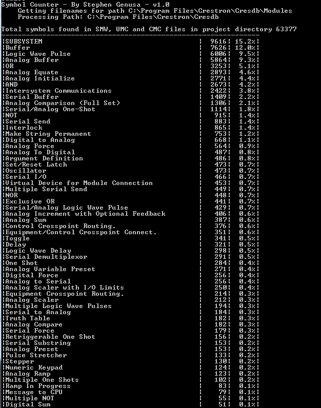

# Crestron Symbol Counter

Python 2.7 used

After I started to understand Crestron programming, I went to my manager with a 2-page printout of all the standard Crestron symbols and asked him to highlight all the symbols that were most frequently used -- which do I study first?

This program is something of a followup to that exercise. Now, parsing the code, I can see which symbols other programmers use the most often.

- Reads CMC, UMC and SMW source code. 
- Attempts to remove all device symbols from the output
- Parses by subdirectory and recursively parses everything located in that subdirectory

Some uses for this utility are:

- To show symbol usage and give some guidance on what a company or programming team considers the most important symbols
- To allow a Crestron programmer to compare symbol usage from one project to another or from a series of projects to another series, or one programmer vs. one or more different programmers, or from internal source code as compared to another code base like Crestron's CMC's or Crestron's Example Programs code.
-  To keep tabs on someone who goes wild with Truth Tables, for example.

It prints a listing out to DOS console but it also creates a CSV file that you can load into Excel, or another spreadsheet program, to do comparisons between code sets.

-------

------

Copyright © 2017 Stephen Genusa

Redistribution and use in source and binary forms, with or without modification, are permitted provided that the following conditions are met:

1. Redistributions of source code must retain the above copyright notice, this list of conditions and the following disclaimer.

2. Redistributions in binary form must reproduce the above copyright notice, this list of conditions and the following disclaimer in the documentation and/or other materials provided with the distribution.

THIS SOFTWARE IS PROVIDED BY THE COPYRIGHT HOLDERS AND CONTRIBUTORS "AS IS" AND ANY EXPRESS OR IMPLIED WARRANTIES, INCLUDING, BUT NOT LIMITED TO, THE IMPLIED WARRANTIES OF MERCHANTABILITY AND FITNESS FOR A PARTICULAR PURPOSE ARE DISCLAIMED. IN NO EVENT SHALL THE COPYRIGHT HOLDER OR CONTRIBUTORS BE LIABLE FOR ANY DIRECT, INDIRECT, INCIDENTAL, SPECIAL, EXEMPLARY, OR CONSEQUENTIAL DAMAGES (INCLUDING, BUT NOT LIMITED TO, PROCUREMENT OF SUBSTITUTE GOODS OR SERVICES; LOSS OF USE, DATA, OR PROFITS; OR BUSINESS INTERRUPTION) HOWEVER CAUSED AND ON ANY THEORY OF LIABILITY, WHETHER IN CONTRACT, STRICT LIABILITY, OR TORT (INCLUDING NEGLIGENCE OR OTHERWISE) ARISING IN ANY WAY OUT OF THE USE OF THIS SOFTWARE, EVEN IF ADVISED OF THE POSSIBILITY OF SUCH DAMAGE.